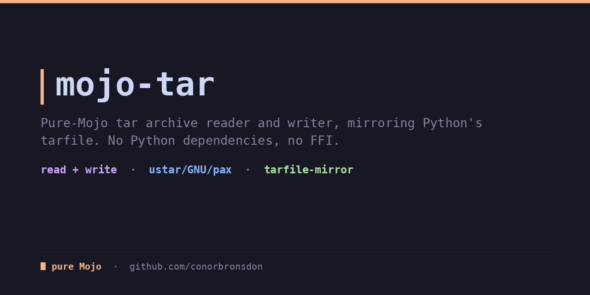
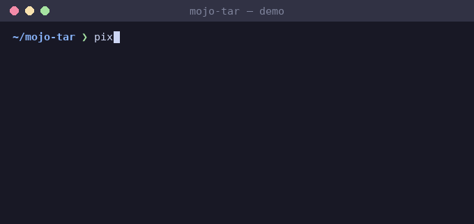

<div align="center">

# mojo-tar

**Pure-Mojo tar archive reader and writer, mirroring Python's tarfile. No Python dependencies, no FFI.**

[](LICENSE)
[](https://mojolang.org)
[](https://chainofthought.show)
[](https://x.com/ConorBronsdon)




</div>

As of mid-2026 the Mojo ecosystem has no library for reading or writing tar
archives. mojo-tar fills that gap: a reader and writer whose API mirrors
Python's [`tarfile`](https://docs.python.org/3/library/tarfile.html) module,
following the Mojo ecosystem convention of matching Python stdlib shapes.

No compression is in scope. mojo-tar concerns itself only with the archive
container; for `.tar.gz` / `.tar.bz2`, pair it with a separate zlib/gzip
library: decompress first, then hand the bytes to `open_tar` (or compress
the bytes `TarWriter.finalize()` returns).

### Coming from Python

If you know Python's `tarfile`, reading and writing map like this:

| Python (`tarfile`)                        | mojo-tar                                                |
| ----------------------------------------- | ------------------------------------------------------- |
| `tf = tarfile.open("a.tar")`              | `var entries = read_tar_file("a.tar")`                  |
| `for m in tf.getmembers(): m.name, m.size`| `for e in entries: e.info.name, e.info.size`            |
| `m.isdir()` / `m.issym()`                 | `e.info.isdir()` / `e.info.issym()`                     |
| `tf = tarfile.open("a.tar", "w")`         | `var w = TarWriter()`                                   |
| `tf.add(...)` / write member              | `w.add("f.txt", data, mode=0o644, mtime=0)`             |
| close / flush to bytes                    | `var archive = w.finalize()  # List[UInt8]`             |

`TarInfo` fields mirror `tarfile.TarInfo` (`name`, `size`, `mode`, `mtime`,
`linkname`, …) with `isfile()` / `isdir()` / `issym()` / `islnk()` helpers.
The writer also has `add_dir(name)` and `add_symlink(name, target)`.

## What it handles

- **ustar format**, including the `prefix` field for long-path splitting.
- **GNU long names** (typeflag `L`).
- **pax extended headers** (typeflag `x` and `g`): the `path`, `size`, and
  `linkpath` keyword records are honored; other records are skipped.
- **Octal and base-256 numeric fields.**
- **512-byte block padding** and end-of-archive zero-block detection.
- **Strict on corruption**: a member whose header fails its checksum aborts
  the parse (like CPython `tarfile`'s `ReadError`). A corrupt header cannot be
  trusted to say where its data ends, and resyncing on its size field is a
  content-smuggling bypass, so the archive is rejected rather than skipped. A
  garbage leading block or a truncated member likewise raises cleanly.
- **Writing**: `TarWriter` emits ustar archives from `(name, bytes, mode,
  mtime)` entries, plus `add_dir` and `add_symlink`. Names longer than 100
  bytes get a leading pax `path` extended header automatically, so the
  full name round-trips and is readable by system `tar`. `finalize()`
  appends the two end-of-archive zero blocks.

## What it deliberately does NOT do

- **Compression.** No gzip/bzip2/xz. Pair mojo-tar with a dedicated
  compression library for `.tar.gz` and friends.
- **Persistent pax globals.** pax global (`g`) headers are applied only to
  the following member, not to the rest of the archive.
- **Follow hard-link data.** Hard-link members are read as metadata, not
  resolved to their target's content.
- **Model device/FIFO content.** Device and FIFO members are read but
  carry no content, matching their type.
- **Emit base-256 numeric output.** The writer always uses ustar (pax only
  for long names); values that overflow an octal field are out of scope —
  the writer raises on an over-range or negative numeric field rather than
  truncating it, and rejects names with an embedded NUL byte.

## Security

mojo-tar returns member names and link targets **verbatim** — it does not
sanitize them. Reading an archive is memory-safe (hostile sizes, truncated
members, and malformed pax records raise cleanly rather than hanging or
over-allocating), but a `TarInfo.name` or `TarInfo.linkname` can still be an
absolute path (`/etc/passwd`), a parent-relative path (`../../etc/passwd`),
or a symlink pointing outside the extraction root.

**If you extract entries to disk, you MUST sanitize before writing.** Reject
or normalize absolute paths and `..` components, and validate symlink targets,
before joining a name to a destination directory. This is the path-traversal
class tracked as [CVE-2007-4559](https://nvd.nist.gov/vuln/detail/CVE-2007-4559)
against Python's `tarfile` (the "tarslip" family) — mojo-tar deliberately leaves
this policy to the caller, exactly as `tarfile.extractall` historically did.

## Install

With [pixi](https://pixi.prefix.dev):

```bash
pixi install
pixi run test
```

Or with uv:

```bash
uv venv
uv pip install mojo --index https://whl.modular.com/nightly/simple/ --prerelease allow
.venv/bin/mojo run -I src test/test_tar.mojo
```

Requires a Mojo nightly (`>=1.0.0b3`).

## Usage

```mojo
from tar import open_tar, read_tar_file, TarReader, TarWriter

def main() raises:
    # Reading, from a filesystem path or bytes you already hold:
    var entries = read_tar_file("archive.tar")
    for e in entries:
        print(e.info.name, e.info.size)
        if e.info.isfile():
            ...  # e.data is the member's content bytes (List[UInt8])

    var entries2 = open_tar(Span(my_bytes))

    # TarReader also exposes checksum warnings and a names() helper:
    var reader = TarReader(Span(my_bytes))
    for w in reader.warnings:
        print(w)

    # Writing:
    var w = TarWriter()
    w.add("hello.txt", String("hello world\n").as_bytes(), mode=0o644, mtime=0)
    w.add_dir("subdir")
    w.add_symlink("link.txt", "hello.txt")
    var archive = w.finalize()   # List[UInt8], the complete .tar bytes
```

Each `TarEntry` pairs a `TarInfo` (metadata) with `data` (the member's
content bytes; empty for directories and links). `TarInfo` fields mirror
`tarfile.TarInfo`: `name`, `size`, `mtime`, `mode`, `typeflag`, `uid`, `gid`,
`uname`, `gname`, `linkname`, with `isfile()` / `isreg()` / `isdir()` /
`issym()` / `islnk()` helpers.

## Tests

```bash
pixi run test
```

29 tests cover header and numeric-field parsing, every fixture archive,
GNU long names, pax path override, writer round-trips, base-256 and prefix
decoding, and clean raises on garbage or truncated input. Fixtures under
`test/data/` are produced by the system GNU `tar` binary
(`--format=ustar|gnu|pax`), and writer output was verified interoperable
against system `tar -tvf` / `tar -xf`: all modes, mtime, pax long names,
symlinks, and directories preserved, `tar --warning=all` silent.

`test/fuzz_runner.mojo` parses `argv[1]` and prints the entry count,
catching raises. Feed it corrupted or random input to confirm it never
crashes.

## Part of a pure-Mojo library suite

Eleven pure-Mojo libraries that mirror familiar Python stdlib and PyPI APIs,
filling gaps in the native Mojo ecosystem:

- [mojo-xml](https://github.com/conorbronsdon/mojo-xml) — general-purpose XML
  parsing, an ElementTree-shaped DOM (Python's `xml.etree.ElementTree`)
- [mojo-feed](https://github.com/conorbronsdon/mojo-feed) — RSS, Atom, and
  JSON Feed parsing (Python's `feedparser`)
- [mojo-captions](https://github.com/conorbronsdon/mojo-captions) — SRT and
  WebVTT subtitle/transcript parsing (no Python stdlib parallel)
- [mojo-html](https://github.com/conorbronsdon/mojo-html) — HTML parsing and
  article extraction (Python's readability)
- [mojo-markdown](https://github.com/conorbronsdon/mojo-markdown) —
  CommonMark markdown parsing (Python's `markdown`)
- [mojo-unicodedata](https://github.com/conorbronsdon/mojo-unicodedata) —
  Unicode normalization and case folding (Python's `unicodedata`)
- [mojo-diff](https://github.com/conorbronsdon/mojo-diff) — text diffing
  (Python's `difflib`)
- [mojo-template](https://github.com/conorbronsdon/mojo-template) — a
  Jinja-flavored template engine (Python's `jinja2`)
- [mojo-redis](https://github.com/conorbronsdon/mojo-redis) — a Redis
  client (Python's `redis-py`)
- [mojo-url](https://github.com/conorbronsdon/mojo-url) — URL parsing
  and encoding (Python's `urllib.parse`)

## Contributing

Issues and PRs welcome, especially real-world archives that read or write
wrong (attach the archive or a minimal reproduction) and interop gaps
against other tar implementations. Run `pixi run test` before sending a
PR.

## About

Built by [Conor Bronsdon](https://conorbronsdon.com) — host of
[Chain of Thought](https://chainofthought.show), a podcast about AI agents,
infrastructure, and engineering. Find me on [X](https://x.com/ConorBronsdon)
or [LinkedIn](https://www.linkedin.com/in/conorbronsdon).

---

## Disclaimer

*All views, opinions, and statements expressed on this account/in this repo are solely my own and are made in my personal capacity. They do not reflect, and should not be construed as reflecting, the views, positions, or policies of Modular. This account is not affiliated with, authorized by, or endorsed by my employer in any way.*

## License

Licensed under the [MIT License](LICENSE).
